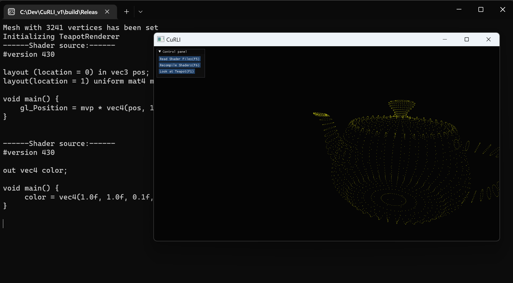

# CuRLI_v1
CS6610 Interactive Computer Graphics HW repository. Stands for **C**omp**U**ter **R**enders **L**ot of **I**mages. It is inteded as a toy renderer/course-project.

**Note to TAs:** If you are viewing this as a PDF it is the same document as the ReadMe.md so you may use that if it is more convinient. 

### Building CuRLI for Windows
---
Building CuRLI for windows requires Cmake 3.0
#### Dependencies 
Most of these dependencies are included as submodules and compiles with CMake. Only dependency that does not exist as submodule is glad which can be downloaded from generated link obtained [glad web page](https://glad.dav1d.de/).
- MSVCv143 - VS2022 C++ or above
- [Cmake 3.0](https://cmake.org/)
- [GLM](https://github.com/g-truc/glm)
- [ImGui](https://github.com/ocornut/imgui)
- [GLFW](https://github.com/glfw/glfw) ~~FreeGlut~~
- [Glad](https://glad.dav1d.de/#language=c&specification=gl&api=gl%3D4.6&api=gles1%3Dnone&api=gles2%3Dnone&api=glsc2%3Dnone&profile=compatibility&loader=on)
- [cyCodeBase](http://www.cemyuksel.com/cyCodeBase/)(only for .obj importer ATM)
- [EnTT](https://github.com/skypjack/entt)

#### Building with Cmake
1. Clone or download the files(unzip the downloaded files).
2. Create a folder to *build* binaries.
3. Run CmakeGui or Cmake select source as the project root directory and where to build binaries as *build* folder.
4. Select Visual Studio 17 2022 as the generator.
5. Configure and Generate
6. Navigate to *build* folder and open curli.sln file with Visual Studio
7. Select Under Build>Build solution(F7)
8. Run the executable i.e. **./curli.exe [params]** from console

### Milestones
---
#### Project 1 - H*llo World
###### Project 1 requirements:
- [x] Creating Window context
- [x] Keyboard listeners where ‘esc’ is used to call `glutLeaveMainLoop();`
- [x] Setting window size, position, name and clear color during initialization.
- [x] Idle function where animation between two colors are generated using linear interpolation of sine value of time(ms).
  
Some Screenshots:

---

#### Project 2 - Transformations
###### Project 2 requirements:
- [x] Integrated `cyTriMesh` class to load .obj files from console arguments. Now path to a .obj mesh needs to be given to executable as the first argument as follows: `./curli.exe path/to/mesh`
- [x] Implemented very simple shaders (/assets/shaders/simple/...) to transform and render vertex points in a constant single color as `GL_POINTS`.
- [x] Implemented tarball controlled lookAt camera where `left mouse button + drag` adjusts two angles of the camera and `right mouse button + drag` adjusts the distance of the camera to *center*.
- [x] Programmed a Imgui window and keyboard shortcuts that allows reloading(`F5`) and recompiling(`F6`) of the shader files. This means that one can edit shader files after curli launches, pressing F5 and F6 will use the edited shaders if compilation is successful.
- [x] Imgui window also includes a button that recenters camera(`F1`) to the mesh center point.
- [x] Pressing `P` also lets user switch between orthographic and perspective projection types.
###### Additional Features:
- [Curiously recurring template pattern](https://en.cppreference.com/w/cpp/language/crtp) has been utulized to have staged renderers and application.
    - Application stages are: `Initialize()`, `Render()`, `DrawGui()`, `Terminate()`.Render and DrawGui are called in a render loop. 
  - Each renderer `A` that implements base class `Renderer<A>` will need to override `Start()` `PreUpdate()` `Update()` and `End()`. These functions are called on various stages of the application allowing custimizable renderers to be written.
- Also programmed a simple event dispatcher system which gets the input&windowing events by `glfw` to be queued. The queued event is resolved in render loop.
  - Each renderer has the option to override certain event calls dispatched by the system if the fuctions are overriden they are called by the `dispatchEvent()`
- Inside `PreUpdate()` function of this projects renderer (`TeapotRenderer`) I set the model matrix of the teapot to a rotation matrix that updates the angle over time. This causes teapot to revolve around itself.

Some Screenshots:

---
#### Project 3 - Shading
###### Project 3 requirements:
- [x] Displayed triangles instead of points
- [x] Uploaded and transforming vertex normals using inverse transpose of model view matrix
- [x] Imlemented Blinn-Phong shading in view space using half angles.
- [x] Added orbital controls to the first point light source inserted into the scene.
###### Additional Features:
- Integrated EnTT --- an entity-component system.
  - Using EnTT several components have been developed:
    - `CLight`: Illuminates the scene currently only as point light but soon other types will be implemented.
    - `CTransform`: A transform component that is traditionally used to generate model matrices for shaders
    - `CTriMesh`: Wrapper for cyTriMesh allows entities to have geometry
    - `CVertexArrayObject`: Allows geometry to be drawn using bound VBOs and EBO(optional). Automaticly handles and selects which draw calls to make.
- Implemented `OpenGLProgram` abstraction which alows convenience binding shaders and uploading uniforms.
- Using the ECS I let shaders render multiple light sources over multiple objects.

Some Screenshots:

